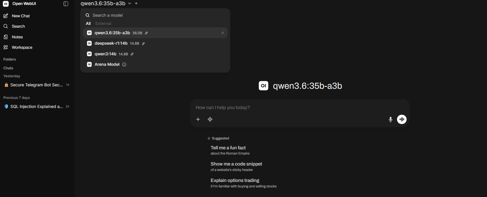
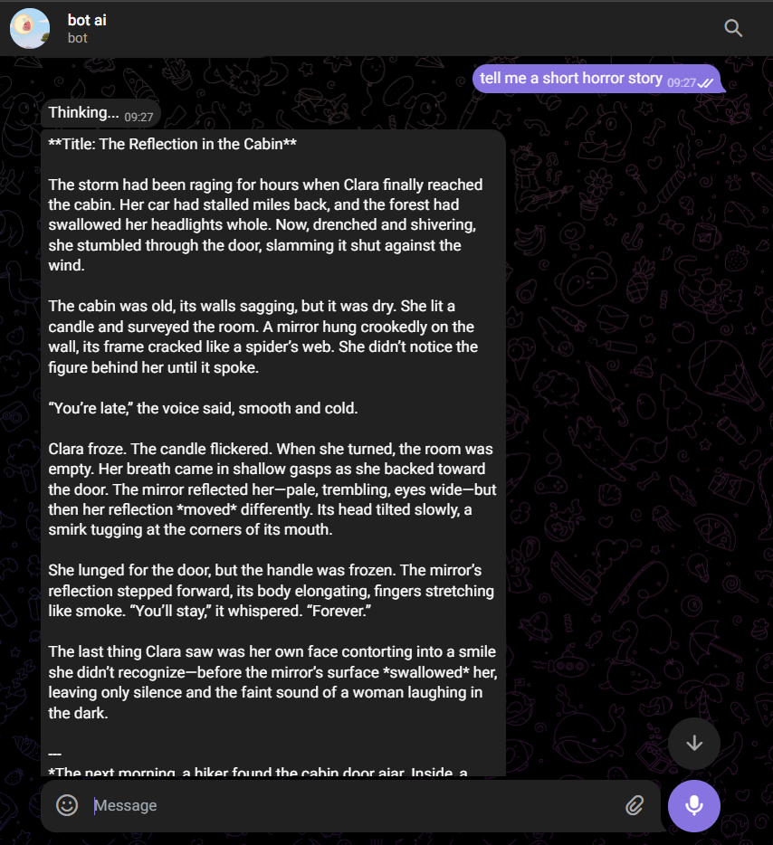
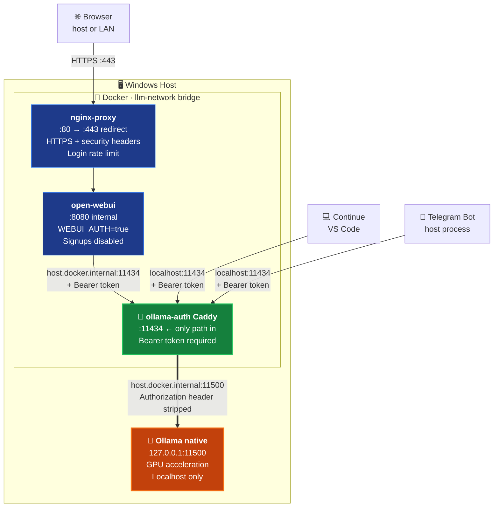
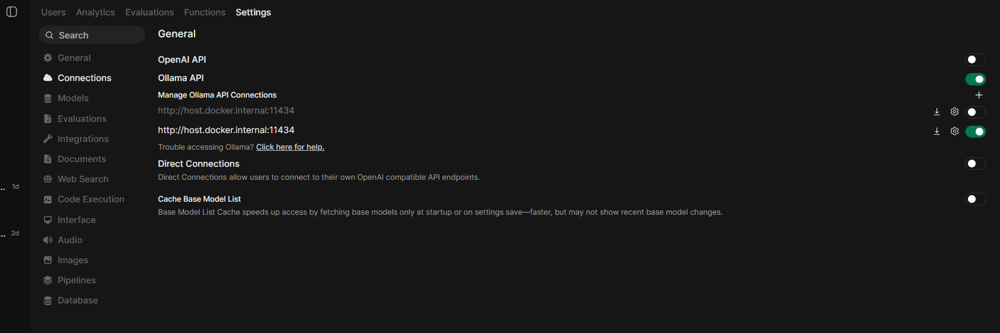

# 🔐 private-ai-stack

## Why This Exists

Running a local LLM should feel like having a private, always-available AI
that nobody else can touch. Out of the box it doesn't work that way.

Install Ollama and fire it up — it works great. But it's completely open.
No password, no authentication, no access control. Anything on your machine
or local network that knows the default port can talk to your GPU, read your
prompts, and burn your VRAM. Most tutorials stop right after "it works" and
never mention this.

This repo is the next step — what you build after "it works" when you
actually care about keeping it yours.

**What you get:**
- **One bearer token** that gates every client — browser, IDE, Telegram bot
- **Ollama hidden** behind an auth proxy on a non-standard port
- **HTTPS** for your local web UI, no plaintext on the LAN
- **Telegram bot** with a user whitelist so only you can use it remotely
- **VS Code integration** via Continue for a local Copilot experience
- **Game mode scripts** to free VRAM instantly when you need your GPU back

Everything runs on your hardware. Your prompts never leave your machine.
No API bills, no data collection, no rate limits.

Tested on a Ryzen 9 9900X + RTX 5070 Ti on Windows 11 — but the patterns
apply to any GPU-equipped Windows machine.

| Open WebUI | Telegram | VS Code Continue |
|:---:|:---:|:---:|
|  |  | *screenshot coming soon* |

---

## Table of Contents

1. [What You'll Build](#what-youll-build)
2. [Why This Setup](#why-this-setup)
3. [Prerequisites](#prerequisites)
4. [Architecture Overview](#architecture-overview)
5. [Step-by-Step Setup](#step-by-step-setup)
6. [The Telegram Bot](#the-telegram-bot)
7. [Continue (VS Code)](#continue-vs-code)
8. [Game-Mode Scripts](#game-mode-scripts)
9. [Verification Checklist](#verification-checklist)
10. [Troubleshooting & Lessons Learned](#troubleshooting--lessons-learned)
11. [What I Learned About Local LLMs](#what-i-learned-about-local-llms)
12. [Security Recap](#security-recap)
13. [Hardware & Performance Notes](#hardware--performance-notes)

---

## What You'll Build

A local LLM stack with three client surfaces, all enforcing the same bearer-token authentication:

- **Open WebUI** — browser chat interface, accessible at `https://localhost` and over your LAN if desired
- **Telegram bot** — chat with your local model from anywhere over Telegram, with a user whitelist
- **Continue (VS Code)** — Copilot-style coding assistant using local models for chat, edits, and autocomplete

Behind the scenes:

- **Ollama** runs bare-metal on Windows with full GPU acceleration, bound to a non-standard localhost port
- **Caddy** runs in Docker as an authentication proxy, the only thing listening on the standard `:11434` port
- **nginx** runs in Docker with HTTPS, security headers, and rate-limited login fronting Open WebUI
- **Self-signed TLS** for local-network access without exposing anything to the internet

---

## Why This Setup

Out of the box, Ollama listens on `127.0.0.1:11434` with **zero authentication**. Anything that can reach that port — any process on your machine, any Docker container with `host.docker.internal` access, anything on your LAN if you accidentally bind to `0.0.0.0` — can use your GPU, your models, and read your prompts.

This isn't a flaw in Ollama. It's a deliberate "developer mode" default. But once you're sharing your machine with friends, running other software, or just want defense-in-depth, you need an actual auth gate.

The pattern this repo demonstrates:

1. **Move Ollama off the well-known port** so unauthenticated direct access stops working for any client that just used the default
2. **Put an authentication proxy on the well-known port** so all existing clients keep working — they just need a key
3. **Strip the auth header before forwarding to Ollama** so Ollama's own request validation doesn't get confused by tokens it didn't issue
4. **Move all secrets to environment variables** so they're not committed to git or copy-pasted in screenshots
5. **Add per-application controls** like a Telegram user whitelist and Open WebUI's own login system

---

## Prerequisites

- **Windows 10/11** with admin access (other OSes work but paths differ)
- **NVIDIA GPU** with at least 12GB VRAM recommended, 16GB+ ideal for 30B+ MoE models
- **Docker Desktop** installed and running
- **Ollama** installed and running ([ollama.com](https://ollama.com))
- **Python 3.10+** for the Telegram bot
- **VS Code with Continue extension** if you want IDE integration
- A **Telegram account** if you want the bot

> 💡 The choice of Windows is deliberate here — most local LLM tutorials assume Linux, but Windows is where most gaming GPUs live. Several Docker-on-Windows quirks are documented in [Troubleshooting](#troubleshooting--lessons-learned).

---

## Architecture Overview



**Key design decisions:**

- **Ollama on port 11500, not 11434.** This is the swap. Anything blindly trying the default port hits Caddy and gets a 401 instead of a model.
- **Caddy strips the `Authorization` header** before forwarding to Ollama. Ollama doesn't natively understand inbound bearer tokens, and recent versions can return 403 if they see one they didn't issue.
- **Auth via Docker network for client-to-Caddy traffic, but Open WebUI uses `host.docker.internal:11434`** to reach Caddy. Direct container-to-container via `ollama-auth:11434` returned 403s consistently — see [Troubleshooting #6](#6-the-docker-bridge-403-mystery).
- **nginx and Caddy serve different purposes.** nginx handles HTTPS, security headers, and login rate limiting for the *web UI*. Caddy handles bearer-token auth for *Ollama API access*. They don't overlap.

---

## Step-by-Step Setup

### Step 1 — Move Ollama to a non-standard port

In Windows: **Settings → System → About → Advanced system settings → Environment Variables**. Under **System Variables**, set:

```
OLLAMA_HOST              = 127.0.0.1:11500
OLLAMA_FLASH_ATTENTION   = 1
OLLAMA_KV_CACHE_TYPE     = q8_0
OLLAMA_MODELS            = D:\OllamaModels    (or wherever you want models stored)
```

Why these values:

- **`OLLAMA_HOST=127.0.0.1:11500`** — moves Ollama off the well-known port and binds to localhost only, blocking LAN access.
- **`FLASH_ATTENTION=1`** — significantly faster prompt processing on supported GPUs.
- **`KV_CACHE_TYPE=q8_0`** — quantizes the KV cache, freeing ~30% of context VRAM with negligible quality loss. Critical on 16GB cards if you want larger context windows.
- **`OLLAMA_MODELS`** on a separate drive keeps your C: drive from filling up — modern coding/reasoning models are 8–25GB each.

Restart Ollama (close the system tray app, kill `ollama.exe` if still running, then relaunch). Verify:

```powershell
netstat -an | findstr :11500
# Should show: TCP 127.0.0.1:11500 ... LISTENING

netstat -an | findstr :11434
# Should show nothing
```

### Step 2 — Generate a bearer token

In PowerShell:

```powershell
[Convert]::ToBase64String((1..32 | %{[byte](Get-Random -Max 256)}))
```

Save the output securely. We'll call this `YOUR_BEARER_KEY` throughout the rest of the guide. You'll paste it into a few config files. Treat it like a password.

### Step 3 — Set up Docker network

```powershell
docker network create llm-network
```

This isolated bridge network is where all your containers will live. They'll be able to talk to each other by name (e.g., `ollama-auth`, `open-webui`) but not be exposed externally except through the explicit port mappings we'll set up.

### Step 4 — Set up Caddy auth proxy

Create the directories and the Caddyfile:

```powershell
New-Item -ItemType Directory -Force -Path C:\DockerData\caddy\logs
```

Save [`configs/Caddyfile`](configs/Caddyfile) to `C:\DockerData\caddy\Caddyfile`, replacing `YOUR_BEARER_KEY` with your real key.

Launch Caddy:

```powershell
docker run -d `
  --name ollama-auth `
  --restart unless-stopped `
  --network llm-network `
  -p 127.0.0.1:11434:11434 `
  -v C:\DockerData\caddy\Caddyfile:/etc/caddy/Caddyfile:ro `
  -v C:\DockerData\caddy\logs:/var/log/caddy `
  --add-host host.docker.internal:host-gateway `
  --log-driver json-file `
  --log-opt max-size=10m `
  --log-opt max-file=3 `
  caddy:2-alpine
```

> The `127.0.0.1:11434:11434` (rather than `11434:11434`) is important — it binds Caddy to your host's loopback only, so even if your Windows Firewall is misconfigured, Caddy isn't reachable from the LAN.

Verify auth works:

```powershell
# No auth → 401
curl.exe -s -o NUL -w "%{http_code}`n" http://127.0.0.1:11434/api/tags

# Correct key → 200 with model list
curl.exe http://127.0.0.1:11434/api/tags -H "Authorization: Bearer YOUR_BEARER_KEY"
```

### Step 5 — Set up nginx + Open WebUI

Create directories and TLS cert:

```powershell
New-Item -ItemType Directory -Force -Path C:\DockerData\nginx\conf
New-Item -ItemType Directory -Force -Path C:\DockerData\nginx\certs
New-Item -ItemType Directory -Force -Path C:\DockerData\open-webui
```

Generate a self-signed cert valid for 10 years:

```powershell
docker run --rm `
  -v C:\DockerData\nginx\certs:/certs `
  alpine/openssl req -x509 -newkey rsa:4096 -nodes `
    -keyout /certs/privkey.pem `
    -out /certs/fullchain.pem `
    -days 3650 `
    -subj "/CN=localhost" `
    -addext "subjectAltName=DNS:localhost,IP:127.0.0.1"
```

Save [`configs/nginx.conf`](configs/nginx.conf) to `C:\DockerData\nginx\conf\nginx.conf`.

Launch Open WebUI (replace `YOUR_BEARER_KEY`):

```powershell
docker run -d `
  --name open-webui `
  --restart unless-stopped `
  --network llm-network `
  -v C:\DockerData\open-webui:/app/backend/data `
  -e OLLAMA_BASE_URL=http://host.docker.internal:11434 `
  -e OLLAMA_API_KEY=YOUR_BEARER_KEY `
  -e WEBUI_AUTH=true `
  -e ENABLE_SIGNUP=false `
  -e DEFAULT_USER_ROLE=pending `
  -e ENABLE_COMMUNITY_SHARING=false `
  --log-driver json-file `
  --log-opt max-size=10m `
  --log-opt max-file=3 `
  ghcr.io/open-webui/open-webui:main
```

Launch nginx:

```powershell
docker run -d `
  --name nginx-proxy `
  --restart unless-stopped `
  --network llm-network `
  -p 443:443 -p 80:80 `
  -v C:\DockerData\nginx\conf\nginx.conf:/etc/nginx/conf.d/default.conf:ro `
  -v C:\DockerData\nginx\certs:/etc/nginx/certs:ro `
  --log-driver json-file `
  --log-opt max-size=10m `
  --log-opt max-file=3 `
  nginx:alpine
```

> Note: `-p 443:443` (no `127.0.0.1:` prefix) makes Open WebUI reachable from your LAN. If you only want it on your local machine, use `-p 127.0.0.1:443:443` instead.

Open `https://localhost`, accept the self-signed cert warning, create your admin account. The first user becomes admin automatically.

### Step 6 — Connect Open WebUI to Caddy

In Open WebUI: **Profile (top right) → Admin Panel → Settings → Connections → Ollama API**:

- URL: `http://host.docker.internal:11434`
- Click the gear icon, paste your bearer key into the API Key field
- Save and refresh. Your models should appear.



> **Why `host.docker.internal:11434` and not `ollama-auth:11434`?** See [Troubleshooting #6](#6-the-docker-bridge-403-mystery). Briefly: traffic from Open WebUI's container directly to Caddy's container via the Docker bridge network was returning 403s in our testing, while the same traffic via the host loopback worked fine. Probably a Docker Desktop on Windows networking quirk.

---

## The Telegram Bot

The bot lives in [`bot/bot.py`](bot/bot.py). It's a single-file Python application using `python-telegram-bot` and `httpx`.


### Step 7a — Install Python dependencies

```powershell
pip install python-telegram-bot httpx
```

### Step 7b — Create a bot via BotFather

1. Open Telegram, message **@BotFather**
2. Send `/newbot`, follow the prompts
3. Save the token it gives you

### Step 7c — Find your Telegram user ID

Message **@userinfobot** on Telegram. It'll reply with your numeric user ID. This is what the bot will whitelist.

### Step 7d — Set environment variables

In an admin PowerShell (so they persist to the User registry, not just this session):

```powershell
[Environment]::SetEnvironmentVariable("TELEGRAM_BOT_TOKEN", "YOUR_BOT_TOKEN", "User")
[Environment]::SetEnvironmentVariable("OLLAMA_API_KEY", "YOUR_BEARER_KEY", "User")
[Environment]::SetEnvironmentVariable("TELEGRAM_ALLOWED_USERS", "YOUR_USER_ID", "User")
```

> `TELEGRAM_ALLOWED_USERS` is a comma-separated list — add more IDs separated by commas if you want to whitelist friends.

> **Important Windows quirk:** env vars set this way only appear in PowerShell windows opened **after** the SetEnvironmentVariable call. Existing terminals are frozen with the environment they had at launch. Always open a fresh PowerShell after changing env vars.

### Step 7e — Run the bot

In a fresh PowerShell:

```powershell
cd path\to\bot
python bot.py
```

You should see:

```
Authorized users: {YOUR_USER_ID}
Bot is running...
```

DM your bot. Send `/start`. You should get a welcome message back. Try a real question.

If unauthorized users message it, you'll see `[REJECTED]` lines in the bot's terminal showing their ID and username, and they get a polite "this bot is private" reply.

---

## Continue (VS Code)

Continue is a free, open-source VS Code extension that gives you a coding-focused chat panel, tab autocomplete, and inline edits — all powered by your local models.


### Step 8 — Configure Continue

Install the [Continue extension](https://marketplace.visualstudio.com/items?itemName=Continue.continue) in VS Code.

Edit `C:\Users\<YourUsername>\.continue\config.yaml` (it'll be created on first launch). Use [`configs/continue-config.yaml`](configs/continue-config.yaml) as your starting point, replacing `YOUR_BEARER_KEY`.

The key fields per model:

```yaml
- name: Display Name
  provider: ollama
  model: qwen3:14b              # match the actual Ollama model name
  apiBase: http://localhost:11434  # Caddy, not Ollama directly
  apiKey: YOUR_BEARER_KEY          # plain key, no "Bearer " prefix — Continue adds that
  roles:
    - chat
    - edit
    - apply
```

Reload VS Code. Open the Continue panel. Ask it something. If you get a response, you're done.

---

## Game-Mode Scripts

GPU-heavy games conflict with Ollama loading large models in VRAM. These scripts let you cleanly pause/resume the LLM stack without trashing anything.

Save [`scripts/llm-start.bat`](scripts/llm-start.bat) and [`scripts/llm-stop.bat`](scripts/llm-stop.bat) to your Desktop (or wherever).

- Double-click **`llm-stop.bat`** before launching a game → frees all VRAM
- Double-click **`llm-start.bat`** when you're done → everything's back

Docker containers stay running — they use trivial CPU/RAM and zero GPU.

---

## Verification Checklist

After full setup, run through these:

```powershell
# 1. Ollama is on 11500 only
netstat -an | findstr "11434 11500"
# Expect: 127.0.0.1:11500 LISTENING (Ollama), 127.0.0.1:11434 LISTENING (Caddy)

# 2. Auth gate works
curl.exe -s -o NUL -w "no-auth: %{http_code}`n" http://127.0.0.1:11434/api/tags
# Expect: no-auth: 401

curl.exe -s -o NUL -w "good-auth: %{http_code}`n" http://127.0.0.1:11434/api/tags -H "Authorization: Bearer YOUR_BEARER_KEY"
# Expect: good-auth: 200

# 3. Docker bypass attempt is blocked
docker run --rm --network llm-network curlimages/curl:latest -s -o /dev/null -w "%{http_code}`n" -m 5 http://host.docker.internal:11434/api/tags
# Expect: 401

# 4. All containers running
docker ps
# Expect: nginx-proxy, open-webui, ollama-auth all "Up"

# 5. Open WebUI loads cleanly
# Browser → https://localhost → log in → models populate → chat works

# 6. Continue works
# VS Code → Continue panel → ask a question → response streams

# 7. Bot works
# Telegram → DM bot → /start → welcome → ask question → response
```

---

## Troubleshooting & Lessons Learned

These are the genuinely surprising issues that ate hours during setup. Each one is documented because someone else will hit it.

### 1. `OLLAMA_API_KEY` env var doesn't gate the local Ollama server

**Symptom**: You set `OLLAMA_API_KEY` system-wide thinking it'll require auth on `:11434`, but `curl http://127.0.0.1:11434/api/tags` (no auth header) still returns the model list.

**Cause**: That env var is for **outbound** authentication when your local Ollama calls `ollama.com` (for cloud models, private model pulls, etc.). It does nothing for **inbound** requests to your local server. Ollama has no native inbound auth.

**Fix**: This is exactly why this whole setup exists. Real auth has to come from a separate proxy (Caddy in this guide).

### 2. PowerShell windows don't see env var changes made after launch

**Symptom**: You run `[Environment]::SetEnvironmentVariable("FOO", "bar", "User")`, then `$env:FOO` in the same window returns blank.

**Cause**: Windows env vars are loaded into a process's environment block at process creation. PowerShell windows opened *before* you set the variable can't see it. The registry has it, but this specific shell's environment block doesn't.

**Fix**: Either close and open a brand-new PowerShell, OR pull the value into the current session manually:

```powershell
$env:FOO = [Environment]::GetEnvironmentVariable("FOO", "User")
```

This is especially insidious when you have a bot running in window A and verify env vars in window B — they can show different values.

### 3. The "Bearer Bearer" double-prefix bug

**Symptom**: Bot returns 401 Unauthorized despite the env var being correctly set.

**Cause**: User pastes the entire `Authorization` header value (`Bearer abc123...`) into `OLLAMA_API_KEY`, but the bot code already adds the `Bearer ` prefix:

```python
headers={"Authorization": f"Bearer {OLLAMA_API_KEY}"}
```

Result: `Authorization: Bearer Bearer abc123...` which doesn't match Caddy's expected `Bearer abc123...`.

**Fix**: `OLLAMA_API_KEY` should be **just the key** — no `Bearer ` prefix. The client code adds the prefix.

### 4. Ollama returns 403 when an `Authorization` header is forwarded

**Symptom**: Caddy authenticates the bearer token, proxies the request to Ollama, and gets back 403 Forbidden.

**Cause**: Recent Ollama versions appear to validate inbound `Authorization` headers if they're present and reject mismatched ones. Caddy was forwarding the (now-validated) bearer header to Ollama, which then rejected it because Ollama didn't issue that token.

**Fix**: Strip the `Authorization` header in Caddy after validation, before forwarding upstream:

```caddyfile
reverse_proxy host.docker.internal:11500 {
    header_up -Authorization
    ...
}
```

Caddy still requires the header for the request to be accepted. Ollama just never sees it.

### 5. nginx rate limit causes 503s on Open WebUI page load

**Symptom**: Closing and reopening the Open WebUI tab gives a flurry of 500/503 errors, requiring rapid refresh-clicking to "break through."

**Cause**: Default rate limit of `10r/s burst=20` is too tight for SvelteKit-based UIs that fire 30–50 parallel requests on load (JS chunks, fonts, favicons, manifest, websocket upgrade). The first 20 get through, the rest 503.

**Fix**: Remove rate limiting from the main `location /` block. Apply it only to specific sensitive endpoints (e.g., `/api/v1/auths/signin` for anti-brute-force). See [`configs/nginx.conf`](configs/nginx.conf).

### 6. The Docker bridge 403 mystery

**Symptom**: Open WebUI configured to talk to `http://ollama-auth:11434` (container name on Docker network) gets consistent 403 errors. Same WebUI configured for `http://host.docker.internal:11434` works perfectly. Same Caddy, same upstream, same auth key.

**Investigation timeline** (for the record):

1. Curl from PowerShell → Caddy → Ollama: ✅ 200
2. Curl from inside Caddy container → Ollama directly: ✅ 200
3. Curl from inside Open WebUI container with all headers replicated → through Caddy: ✅ 200
4. Open WebUI's actual app code → through Caddy via container network: ❌ 403 every time
5. Open WebUI's actual app code → through Caddy via `host.docker.internal`: ✅ 200

After exhaustive header diffing (we tested `Origin`, `Host`, `X-Forwarded-For`, `Content-Type`, `Accept-Encoding`, etc., all individually and combined — none reproduced the 403), no single header was the cause. The 403 only appeared with the specific traffic pattern of container-to-container via Docker bridge in this configuration.

**Working theory**: Docker Desktop on Windows uses different networking paths for `container_name`-based DNS vs. `host.docker.internal`. Combined with whatever Ollama is doing internally to validate proxied requests, something in the chain rejects bridge-network traffic.

**Fix**: Use `http://host.docker.internal:11434` in Open WebUI's connection settings. Same auth, same server, just a different network path that works.

If anyone reading this can pin down the exact cause, please open an issue!

### 7. The "two bots running" Telegram conflict

**Symptom**: Bot starts, immediately spams `telegram.error.Conflict: terminated by other getUpdates request; make sure that only one bot instance is running` in console.

**Cause**: A previous `python bot.py` process didn't fully die. Telegram's `getUpdates` API only allows one polling client per bot token at a time.

**Fix**:

```powershell
taskkill /IM python.exe /F
taskkill /IM python3.exe /F
Get-Process | Where-Object { $_.Name -like "python*" }   # confirm nothing left
```

Then start fresh.

### 8. The "open-webui shows 'my-secret-key-change-this'" tell

**Symptom**: Open WebUI's container env shows `OLLAMA_API_KEY=my-secret-key-change-this`.

**Cause**: That string is a literal placeholder from many tutorials. Seeing it means the user copy-pasted a tutorial's docker run command and never substituted in a real key.

**Fix**: Generate a real key (Step 2). Either set it via `docker run -e OLLAMA_API_KEY=...` or via Open WebUI's admin panel under Connections → Ollama API → gear icon.

### 9. Stale `Bearer` prefix persisted to User-scope env var

**Symptom**: Despite supposedly setting `OLLAMA_API_KEY` correctly, the bot still 401s.

**Cause**: User had `$env:OLLAMA_API_KEY = "Bearer xyz..."` (with prefix) in a session, then ran `[Environment]::SetEnvironmentVariable("OLLAMA_API_KEY", $env:OLLAMA_API_KEY, "User")` to "persist whatever I have set." That snapshotted the wrong value into the User-scope registry.

**Fix**: Always set the env var with the explicit clean value, not by snapshotting current session state:

```powershell
[Environment]::SetEnvironmentVariable("OLLAMA_API_KEY", "actual-key-no-bearer-prefix", "User")
```

And use `repr()` in Python to verify what the bot actually reads:

```powershell
python -c "import os; print(repr(os.environ.get('OLLAMA_API_KEY')))"
```

The `repr()` reveals sneaky whitespace, hidden chars, or `Bearer ` prefixes that visual inspection misses.

---

## What I Learned About Local LLMs

**1. The "Ollama just works" defaults are dev-mode defaults.**
No auth, default localhost binding, models loaded indefinitely. This is fine for solo experimentation but doesn't match what most people imagine when they hear "local AI." Real deployment means thinking about auth, resource limits, and process management explicitly.

**2. MoE models punch above their weight on memory-constrained hardware.**
A 35B-A3B model (35B total params, 3B active per token) on a 16GB VRAM card runs surprisingly well even when the full model spills to system RAM, because only the 3B active subset is touched per token. This is a much better fit for prosumer hardware than dense 30B+ models, which crawl on anything under 24GB VRAM.

**3. Quantization is more important than picking the "best" model.**
A Q4_K_M version of a 32B model fits in 16GB VRAM and gives ~95% of the Q8 quality. A Q8 version of the same model spills heavily to RAM and runs 5-10x slower. For interactive use, the Q4 is just a better experience.

**4. Context window size has nontrivial VRAM cost.**
Bumping context from 8K to 60K can eat several GB of VRAM and tank speed once the KV cache spills. For coding work, 16K–32K is usually plenty. Don't enable 128K context just because the model supports it.

**5. The bottleneck for "local AI feels good" is rarely model intelligence.**
It's first-token latency (cold loads from HDD are brutal), ergonomics of the chat UI, and how well the model integrates into your real workflow. A fast 14B model in your IDE with proper autocomplete beats a 70B model in a separate browser tab for actual productivity.

**6. Streaming matters more than you'd think.**
Make sure your reverse proxy doesn't buffer responses. Caddy's `flush_interval -1` setting in the Caddyfile is what makes responses stream token-by-token instead of arriving as one big block at the end.

**7. The auth model for local AI is genuinely unsolved at the consumer tier.**
Ollama doesn't do it. Most tutorials either ignore it or hand-wave it. Open WebUI's auth is for its own UI, not for the underlying Ollama. The Caddy-as-bearer-gateway pattern in this guide isn't novel, but it's not the documented default anywhere either.

---

## Security Recap

What this setup defends against:

| Threat | Mitigation |
|---|---|
| Random LAN access to Ollama | Localhost-only binding (127.0.0.1) |
| Other local processes hitting Ollama | Ollama on non-standard port, Caddy bearer auth on the standard one |
| Other Docker containers reaching Ollama | Same — they hit Caddy, fail without bearer token |
| Ollama returning 403 to legit forwarded requests | Caddy strips `Authorization` header after validating |
| Telegram bot abuse by random users | Per-user-ID whitelist with logging of rejected attempts |
| Open WebUI signups by strangers on LAN | `WEBUI_AUTH=true` + `ENABLE_SIGNUP=false` + `DEFAULT_USER_ROLE=pending` |
| Brute-force login against Open WebUI | nginx `limit_req` zone on `/api/v1/auths/signin` |
| Plaintext credentials in source code | All secrets via env vars; `.gitignore` covers `.env` files |
| Plaintext credentials in browser DevTools | HTTPS via self-signed cert; HSTS header |
| Clickjacking / XSS / MIME-sniff exploits | nginx security headers (X-Frame-Options, X-Content-Type-Options, etc.) |
| Old Ollama processes lingering with stale config | Documented kill procedure; verify with `netstat` |

What this setup does **not** defend against:

- A compromised admin account on the host machine — they can read env vars and `config.yaml` files
- A malicious Python package installed in the bot's venv reading the env at startup
- Telegram itself being compromised
- The bearer key being leaked (e.g., committed to git)

For those, you'd want OS-level secret management (Windows Credential Manager, etc.), code review, and key rotation as separate practices.

---

## Hardware & Performance Notes

This setup was built and tested on:

- **CPU**: AMD Ryzen 9 9900X (12 cores)
- **GPU**: NVIDIA RTX 5070 Ti (16GB VRAM)
- **RAM**: 64GB DDR5
- **OS**: Windows 11

Models tested and observed:

| Model | Size | VRAM | Speed | Use case |
|---|---|---|---|---|
| `qwen3:14b` | 9.3GB | Fits in VRAM | ~50 tok/s | Fast general use, autocomplete |
| `deepseek-r1:14b` | 9GB | Fits in VRAM | ~45 tok/s | Step-by-step reasoning |
| `qwen3.6:35b-a3b` (MoE) | 23GB | Spills to RAM | ~20 tok/s | Heavy coding tasks |

The 35B-a3b MoE is the standout here — despite being too big for VRAM, the 3B active params per token mean it runs surprisingly well even with significant CPU offload. If you have a 12GB+ card, it's worth trying.

---

## Repo Contents

```
private-ai-stack/
├── README.md                           # this file
├── configs/
│   ├── Caddyfile                       # bearer-token auth proxy config
│   ├── nginx.conf                      # HTTPS reverse proxy for Open WebUI
│   └── continue-config.yaml            # VS Code Continue extension config
├── bot/
│   ├── bot.py                          # Telegram bot
│   └── requirements.txt                # Python dependencies
├── scripts/
│   ├── llm-start.bat                   # bring stack up (game mode off)
│   └── llm-stop.bat                    # take stack down (game mode on)
├── screenshots/
│   └── README.md                       # what each screenshot should show
├── docker-compose.yml                  # alternative compose-based setup
├── .env.example                        # env var template — copy to .env and fill in
├── .gitignore
└── LICENSE
```

---

## License

MIT — do whatever you want with this. Attribution appreciated but not required.

If you build on this or hit issues not documented here, please open an issue or PR. The point of the guide is to save someone else the time it took to figure this out.
